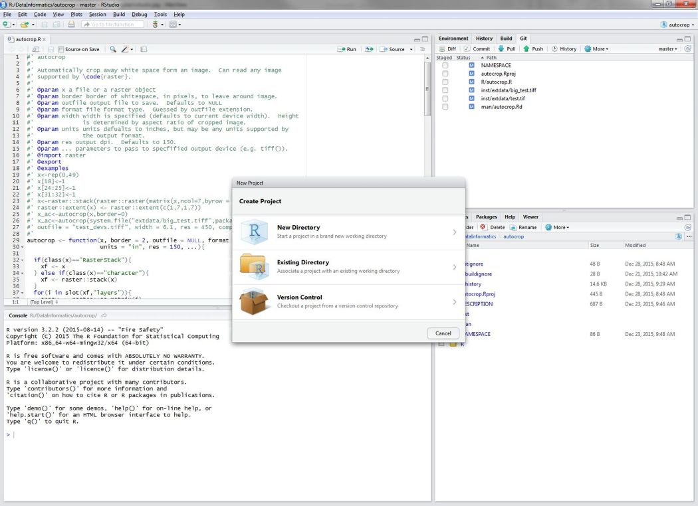

# RStudio

In this first lesson we are going to go over the very basics of using RStudio.  We need to do this so we can jump into our example.

## Lesson Outline:

- [Working with RStudio](#working-with-rstudio)

## Lesson Exercises:
- [Exercise 1.1](#exercise-11)

## Working with RStudio
Over the last several years, RStudio has become a very popular IDE (integrated development environment) for R. In addition to interacting with the R Console, RStudio has many extras built in including version control integration, package building, reproducible research, de-bugging, and built-in text editor with smart highlighting and code completion.  This is the environment we will be using for the workshop and should set you up for continued learning with R.

Before we get to the first exercise, let's spend a bit of time working with RStudio.  You can follow along on your own machines as we try different things with RStudio.

### Fire up R and RStudio
Find the RStudio shortcut or menu (OS specific of course) and fire it up.  Once done, it should look something like:

Let's take some time to look around.  I'll show each of the different sections, or "panes" as they are known.

### Projects

Projects are a way to organize your work in RStudio.  Essentially they are folders, but with a few added files so that you can manage some options on a per project basis. I HIGHLY recommend using projects as they take care of a lot of things for you.  It is what we will be using in this workshop. To create a new project use File:New Project, or use the drop-down on the top right of the RStudio window.  It will look like this after you select "New Project..."

### Source

The source you work on will often be in R scripts (i.e., text files that hold the code you write), but could also include R Markdown files (`.Rmd`), HTML files, or other programming language scripts (e.g. javascript).  In this workshop, we will work with R Scripts (e.g `.R` files) and the console during this workshop.  To create a new R script you can use "File:New File:R Script".

### Interacting with R inside of RStudio

Once you have code in your R Script, that code still need to be sent to the R console and interpreted by R.  There are several ways to do this.  There is the old stand-by of copying and pasting, but this is a bit cumbersome.  Instead you can use the `Run` menu in the upper right corner of the source pane, or even better (I think so, anyway) you can use `ctrl-enter`.  Both the `Run` buttons and `ctrl-enter` will send the line that your cursor is on and move to the next line or it will send just the selected text.

## Exercise 1.1

Now that we have RStudio opened and know are way around a bit, we are going to jump straight to the end and see what a complete R script looks like, run the code and be amazed!  This is kind of like telling a joke by starting with the punch line first!

1. Follow the link to [The Punch Line](punchline.md) and we will work through that together to get more familar with R Studio, R Scripts, and R. 

