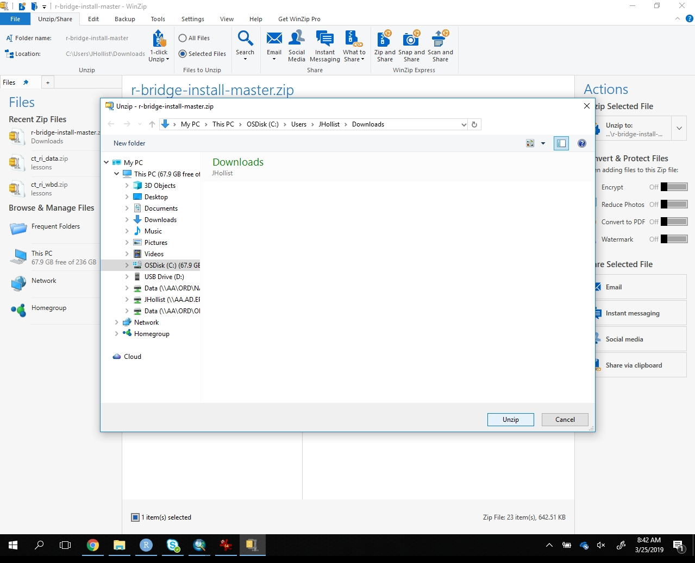
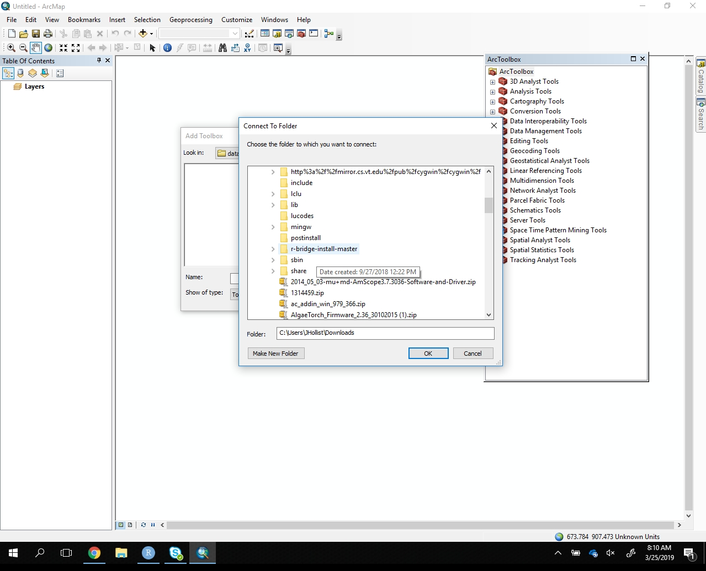

```{r setup, echo=FALSE, warning=FALSE, purl=FALSE, message=FALSE}
library(knitr)
options(repos="http://cran.rstudio.com/")
opts_chunk$set(fig.path="figures/",R.options=list(max.print=100),message = FALSE,
               warning = FALSE, error = FALSE)
if(!require("ggplot2")){
  install.packages("ggplot2")
}
if(!require("dplyr")){
  install.packages("dplyr")
}
if(!require("tidyr")){
  install.packages("tidyr")
}
library("ggplot2")
library("dplyr")
library("tidyr")
library("readr")
library("readxl")
```

# R-ArcGIS Bridge

Can we use ArcGIS server and the R-ArcGIS bridge together?

Yep! http://enterprise.arcgis.com/en/server/latest/publish-services/windows/deploying-r-for-arcgis-server.htm

## Install R-ArcGIS Bridge

Download


Extract


Install in Arcgis
  - folder connect
  
  
  
  - run python install
  
  

https://github.com/R-ArcGIS/r-bridge-install

https://community.esri.com/groups/rstats

shows install and R (at 10:53): https://community.esri.com/videos/3343
 - this shows how to work in R with ArcGIS mxd as source - not what we want

https://highered-esricanada.github.io/r-arcgis-tutorials/1-Getting-Started.pdf
https://esricanada-ce.github.io/r-arcgis-tutorials/
