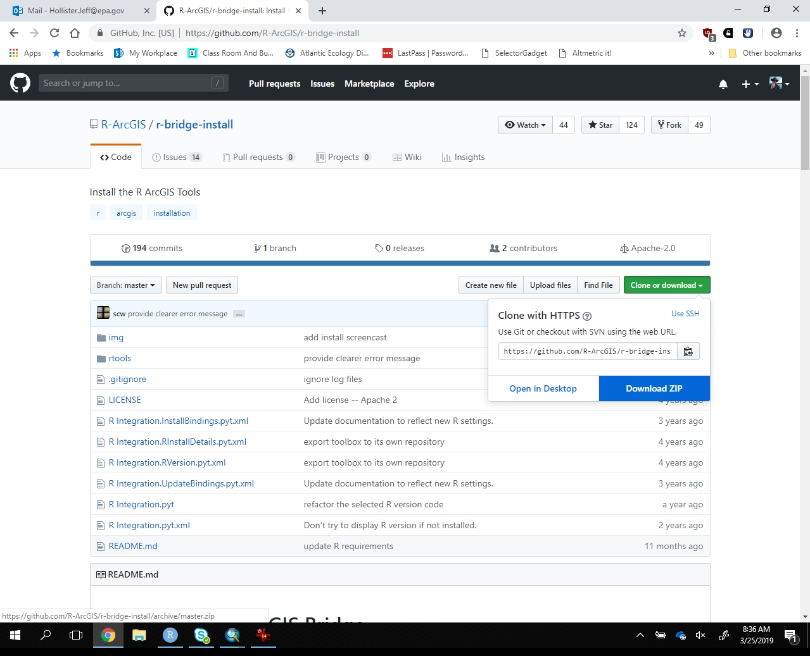
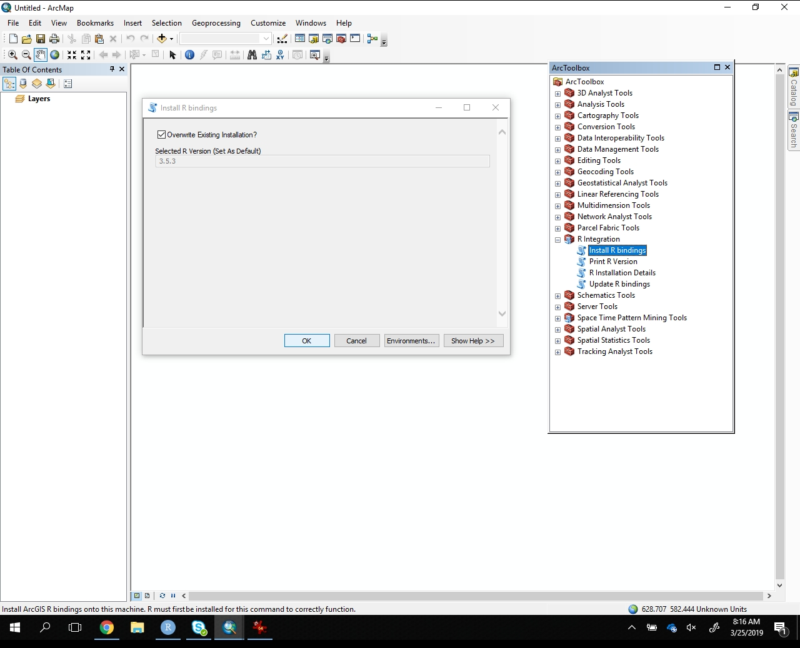

```{r setup, echo=FALSE, warning=FALSE, purl=FALSE, message=FALSE}
library(knitr)
options(repos="http://cran.rstudio.com/")
opts_chunk$set(fig.path="figures/",R.options=list(max.print=100),message = FALSE,
               warning = FALSE, error = FALSE)
if(!require("ggplot2")){
  install.packages("ggplot2")
}
if(!require("dplyr")){
  install.packages("dplyr")
}
if(!require("tidyr")){
  install.packages("tidyr")
}
library("ggplot2")
library("dplyr")
library("tidyr")
library("readr")
library("readxl")
```

# R-ArcGIS Bridge


## Install R-ArcGIS Bridge

Installing the R-ArcGIS Bridge is not difficult, but it is also not a terribly streamlined process.  Outlines below are the steps to get it up and running.

### Download

First, we need to download the Bridge from <https://github.com/R-ArcGIS/r-bridge-install>. 



### Extract

With the Bridge downloaded as a zip file, we need to extract it.  In this example, I extract to the "Downloads" folder.  Were this a more permanent example, I'd likely think about a better place to extract and store the bridge code.  


### Install in ArcMap

Next step is to install everything in ArcMap which will require adding our the "R Integration" ArcToolbox and installing the R bindings. 

  - Add Toolbox
  - Connect extracted folder onnect
  
  
  
  
  
The "R Integration" ArcToolbox has a script, "Install R Bindings" for taking care of the installation process.  

  - Install R Bindings
  
  


In theory, we should be good to go and can now connect ArcGIS with R.

## Working with the R-ArcGIS Bridge

Quick caveat...  All I know about the R-ArcGIS Bridge, I learned in the last couple of days.  Any statements I make, should be taken with a large grain of salt.

The primary purpose of the R-ArcGIS Bridge (aka, the Bridge) is to allow us to move back and forth between R and ArcGIS more easily.  That is achieved through the R Package, `arcgisbinding` which allows for connecting to datasets, conversions to R native spatial formats, and for connecting R scripts via script tools in ArcToolbox.

The two primary workflows for this are, working with Arc from within R and connecting to R, via script tools, from ArcGIS.  As I see it, the later will be more useful as it allows work done in R to be made available to GIS users who do not also know R.  Were I to work with spatial data directly in R, I would likely be more direct in how I accessed that and use the `sp` or `sf` packages, for instance.  That being said, developing scripts for use in ArcGIS can be done initially in R with the `arcgisbinding` package with the goal of eventually linking a script tool to that R code.

For our examples we will be writing a fairly simple R script in RStudio that we then connect up to a script tool in ArcMap by converting that script to a function that deals with the ArcTool inputs and ouputs.

### Working just in R

Here's some code showing how we would work with the `arcgisbining` package in R

```{r arcgisbind}
# Example script: how to work with spatial data using the arcgisbinding package.

# Load up the argisbinding package and get your license
library(arcgisbinding)
arc.check_product()

# Save the path to some example data
path_to_data <- "nla_wq.shp"

# Opens a spatial data file: works with feature classes, layers, raster, etc.
# Appears to be just pointers and basic info, not the actual data
d <- arc.open(path_to_data)
d

# This actually pulls data into R from the input data source. Result is a data 
# frame with spatial details stuck on at the end there are functions to convert 
# from this "arc.data" object to more R native formats (e.g arc.data2sf())
d_sel <- arc.select(d)
d_sel
plot(log1p(d_sel$ptl), log1p(d_sel$chla))

# d_sel is a data frame so we have access to the data in it to do want we want
# inside of R.  we can for instance, fit a linear model and add predictions from
# that model back onto the data frame
xlm <- lm(log1p(d_sel$chla) ~ log1p(d_sel$ptl))
d_sel$lm_pred <- exp(predict(xlm)) - 1
d_sel


# With our predictions saved, let's write back to the original
arc.write(path_to_data, d_sel, overwrite = TRUE)
```

This is great, but from a purely function standpoint of answering the question, "How would I run a regression on data in a shapefile?" using the `arcgisbinding` package isn't really necessary as I could do this (and would do this) using `sf` to read in everything.  That wouldn't require

The utility, again as I see it, is if we want to connect R tools to ArcGIS.  To do this, the code we wrote above will need to be modified.  If you have used python scripts as the source for an ArcGIS script tool, this will be somewhat familiar.  Essentially, we need to convert the code above into a function and deal with the inputs and outputs as they are passed from the ArcGIS script tool to R.

### Connecting ArcGIS to an R function

Open up a new R script in RStudio and save it as "lm_scripttool.R".

In that script, copy the following code.  We will go throught this line by line so that we understand what is going on

```{r eval=FALSE}
#' Example R-ArcGIS Bridge tool
#' 
#' Takes input data from ArcGIS, regresses y on x and adds predicted values back 
#' to the feature class
tool_exec <- function(in_params, out_params){
  input_data <- in_params$input_data
  y <- in_params$y
  x <- in_params$x
  out_fc <- out_params$output_data
  
  d <- arc.open(input_data)
  d_sel <- arc.select(d)
  
  xlm <- lm(log1p(d_sel[[y]]) ~ log1p(d_sel[[x]]))
  d_sel$lm_pred <- exp(predict(xlm)) - 1
  
  arc.write(out_fc, d_sel, overwrite = TRUE)
  
  return(out_fc)
}
```


Now that we have a function set up, let's link that to an ArcGIS script tool.

First, let's create a new toolbox to hold all of our awesome R based tools.  Maybe call it `clear_r_tools`.


Second, add a new script tool


Now we need to enter in the source of the script and the information the tool passes on to R.

1. Provide a Name.  Keep it simple without spaces or underscores.  I used "regressr"
2. The label is what shows up in the ArcToolbox.  Let's use "Regression Tool".
3. Select "Next>"


4. Browse to where you saved "lm_scripttool.R"

5. Select "Show command window when executing script"

6. Select "Next>"

7. Now we need to fill out the details.

|Display Name|Data Type     |Property      |Value      |
|------------|--------------|--------------|-----------|
|input_data  |Feature Layer |              |           |
|y           |Field         |Obtained from |input_data |
|x           |Field         |Obtained from |input_data |
|output_data |Feature Layer |Direction     |Output     |

8. "OK"

We now have a tool, in ArcGIS, that uses R to run a regression, return the predictions of that regression onto a new field in the output.

Let's try to run it!

1. Add the "nla_wq.shp" file that we created in lesson 3 to our ArcMap document.
2. Open up the "Regression Tool".


3. Select "nla_wq" as the "input_data" value.
4. Select "chla" as the "y" value.
5. Select "ptl" as the "x" value.
6. Click "OK"
7. Right click on "nla_wq_regressr" (or a similarly named layer) that should now be in your Table of Contents and select "Open Attribute Table".  You should have a new field, `lm_pred` with the predicted chlorophyll values on it.

Hey... We did it!  We've tied R to ArcGIS and succesfully built a tool that uses R.  Time for a celebration!

## Some links I used to learn this

- 
- 
- 

