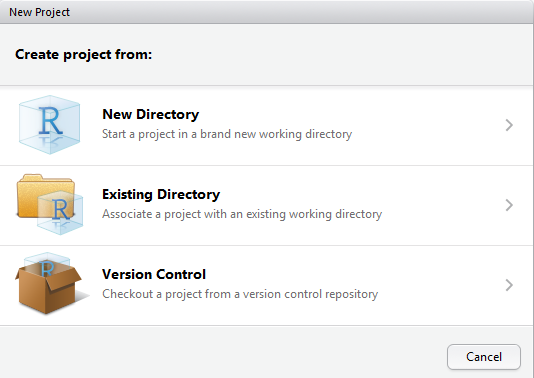
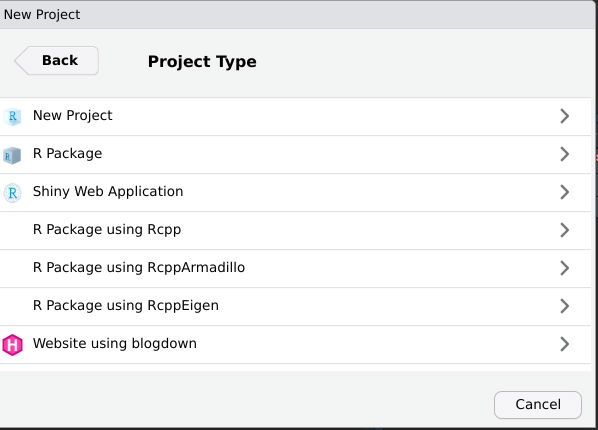
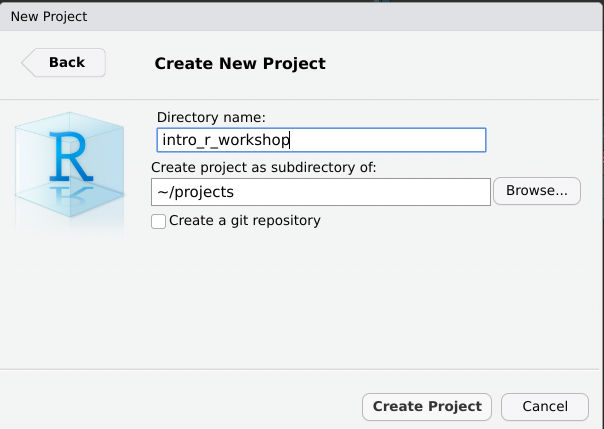

# The Punch Line First

For this workshop we are starting at the end and working backwards.  As such this first lesson is going to be in a follow the leader mode.  This is a useful way to teach this as we get to see what is possible early on and then we can focus on the details of how we get there and you will have a working example of an R script that includes a full data analysis.  Let's get started:

## Create a new project in RStudio

We will use the RStudio "File:New Project" dialog to create a new project to house our work for this workhsop.  In RStudio you need to find the New Project menu.

Then select "New Diectory"

Then select "New Project"

The select "Create Project."  Name this project "usepa_intro_r". At this point you should now have a new, empty project.  We need to download the R Script and some data that we will be using for our workshop.  Right click on each of the the links below and select "Save Link As".  In the window that opens up, browse to the location of the project and save these files to the project folder.

- [NLA R Analysis](https://raw.githubusercontent.com/usepa/intro_r_workshop/master/lessons/nla_analysis.R)
- [2007 NLA Water Quality Data](https://www.epa.gov/sites/production/files/2014-10/nla2007_chemical_conditionestimates_20091123.csv)

## Run the script

And now we can run the script by selecting all lines (i.e. `ctrl-a`) and then clicking on the `Run` button

